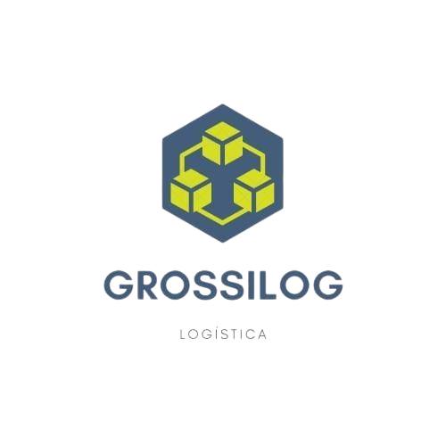
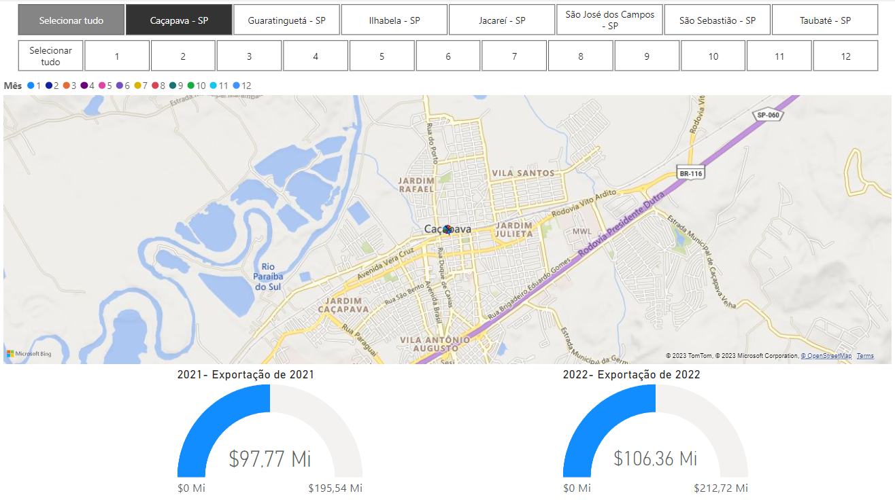
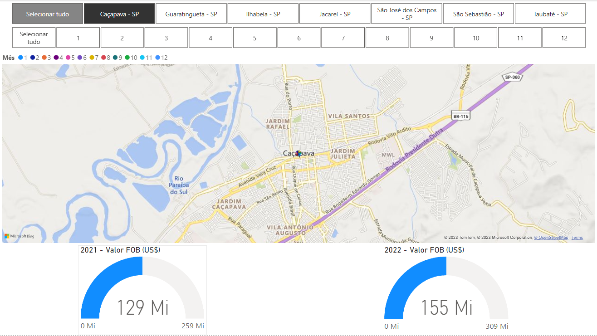
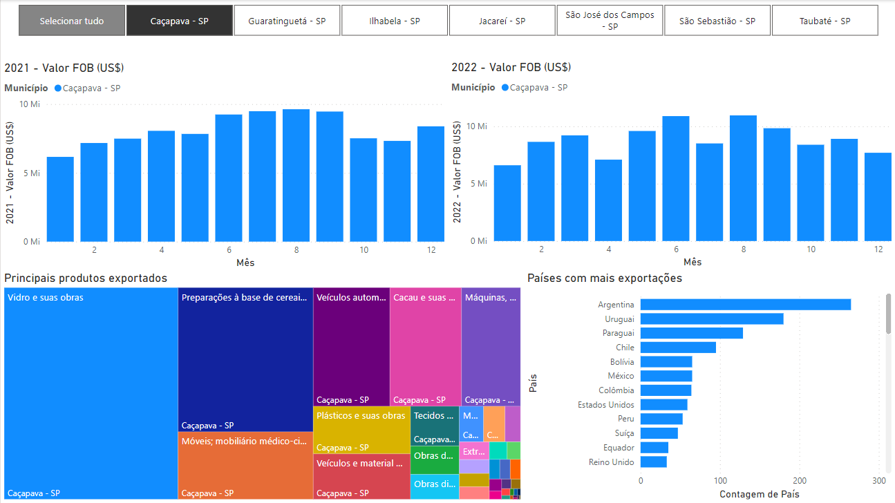
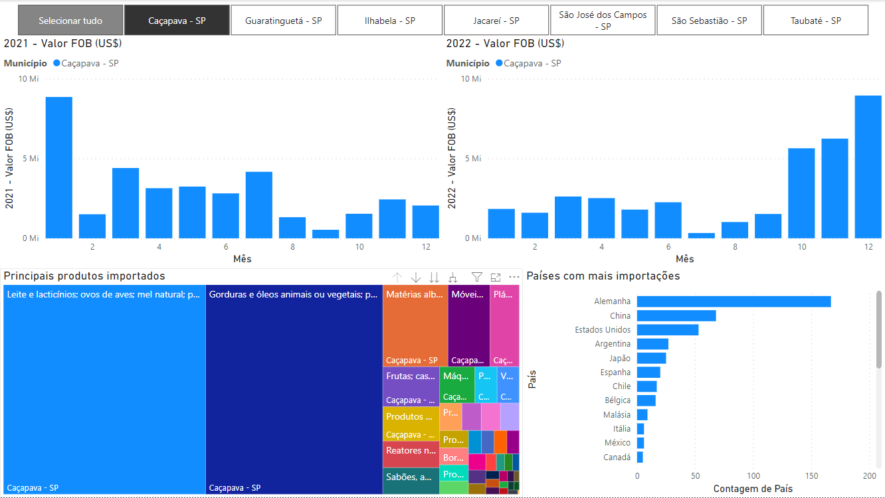
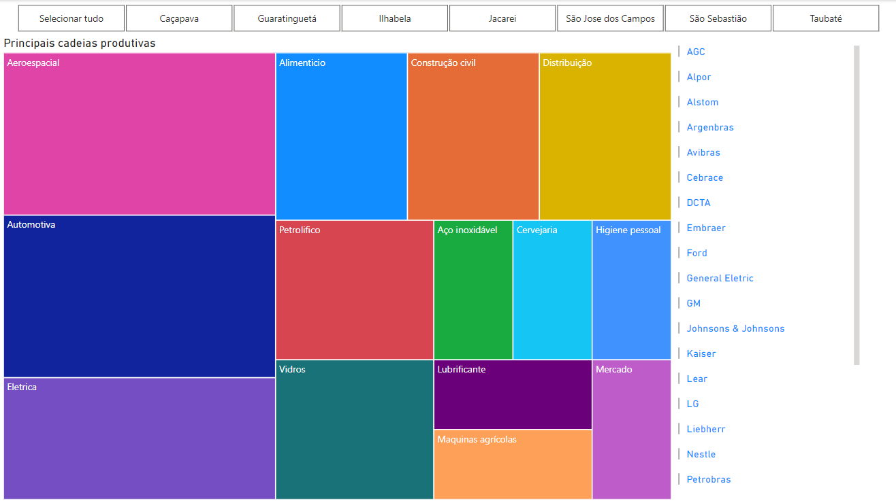

## GrossiLog

  

## Projeto
⚪ <a href="https://app.powerbi.com/Redirect?action=OpenApp&appId=66bdd59d-e517-4eed-a300-9fe6774afe9c&ctid=cf72e2bd-7a2b-4783-bdeb-39d57b07f76f"> Dashboard atualizada

## Entregas
🟢 Sprint 1- 03/04/2023  
🟢 Sprint 2- 24/04/2023  
⚪ Sprint 3- 01/06/2023  
⚪ Sprint 4- 12/06/2023

## Objetivo
Nosso objetivo nas primeiras sprints foi adquirir habilidades na manipulação dos dados importados do site ComexStat. Coletamos todas as informações de valores de importação e exportação das principais cidades da RMVALE (Região Metropolitana do Vale do Paraíba) a fim de obter uma compreensão abrangente das transações comerciais na região. Com base nessa compreensão inicial, direcionamos nossos esforços nas sprints seguintes para explorar e analisar mais detalhadamente uma cadeia produtiva específica, com o objetivo de trazer dados mais aprofundados e insights relevantes nessa área específica.

## Tecnologias

As seguintes ferramentas foram usadas na construção do projeto:

⚪ Pacote Office (https://www.microsoft.com/pt-br/microsoft-365/free-office-online-for-the-web)  
⚪ Jira Software (https://www.atlassian.com/br/software/jira)  
⚪ Power BI (https://powerbi.microsoft.com/pt-br/) 
⚪ Canva (https://www.canva.com/pt_br/)  

## Processo

Nas telas iniciais, são apresentados os valores FOB de cada uma das sete cidades selecionadas para a pesquisa. Esses valores representam as transações comerciais de importação e exportação realizadas por essas cidades.
  

  

  

  
Nas telas seguintes, é possível visualizar os valores com a classificação dos produtos utilizando o código SH4 e os países envolvidos nessas transações. Isso permite uma análise mais detalhada das especificidades dos produtos e das relações comerciais estabelecidas com diferentes países.
  

  

  

  
Na última tela, realizamos uma segmentação da cadeia produtiva por empresa. Para isso, realizamos uma busca das principais empresas localizadas dentro das cidades estudadas e apresentamos os resultados obtidos. Essa segmentação permitiu uma análise mais específica das atividades e contribuições de cada empresa na cadeia produtiva em questão.
  

  

## Integrantes 

<table align="left">
  <tr>
     <td align="center"><a href="https://github.com/Jhoww28">         <b>Jonathan Martins Master</b></a>  
     <td align="center"><a href="https://github.com/AnaJ240">         <b>Ana julia PO</b></a> 
     <td align="center"><a href="https://github.com/joaogabgr">         <b>João Gabriel Team</b></a> 
     <td align="center"><a href="https://github.com/Calszika2001">         <b>Caliel Henrique Team</b></a>      
     <td align="center"><a href="https://github.com/JJI1012">         <b>Jocemar Carlos Team</b></a>      
</table>
