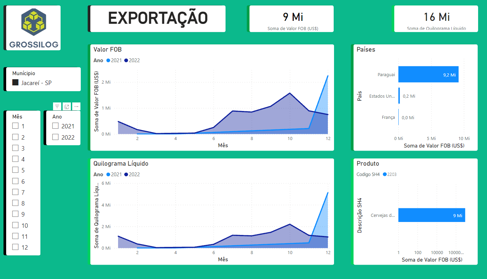
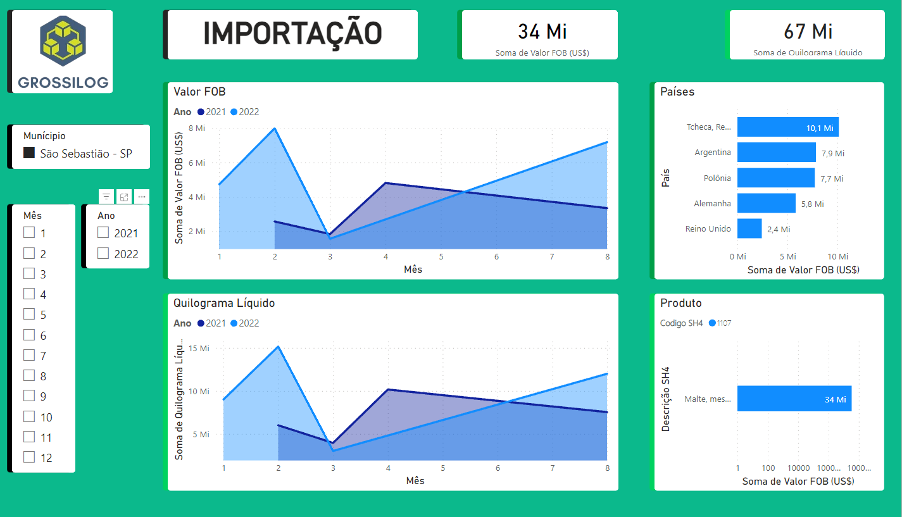
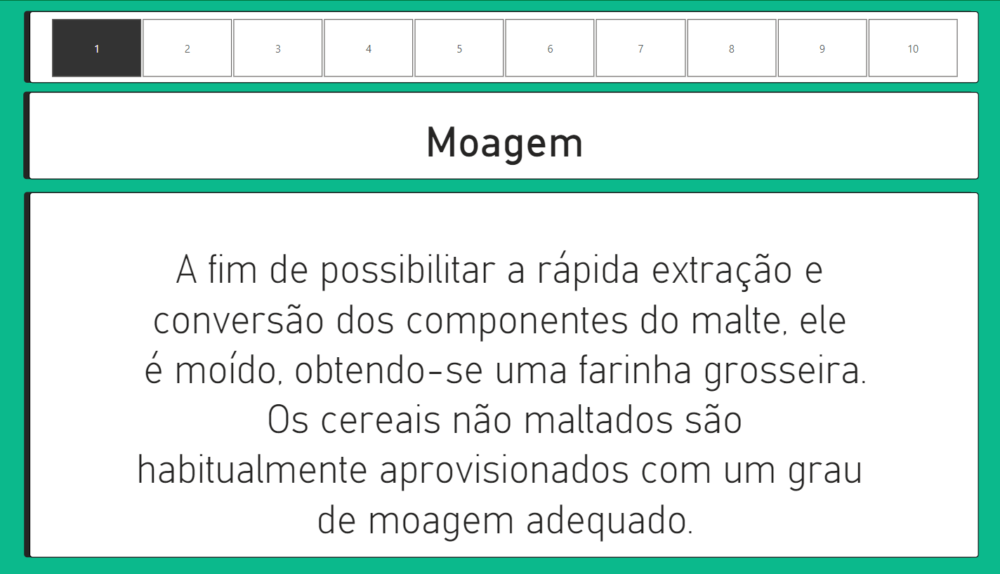
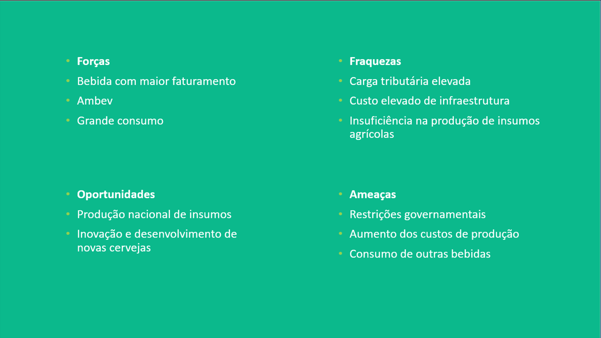

## GrossiLog

  

## Projeto
⚪ <a href="https://app.powerbi.com/Redirect?action=OpenApp&appId=66bdd59d-e517-4eed-a300-9fe6774afe9c&ctid=cf72e2bd-7a2b-4783-bdeb-39d57b07f76f"> Dashboard atualizada

## Entregas
🟢 Sprint 1- 03/04/2023  
🟢 Sprint 2- 24/04/2023  
🟢 Sprint 3- 01/06/2023  
🟢 Sprint 4- 12/06/2023

## Objetivo

Nosso foco na quarta sprint foi finalizar os últimos detalhes para a conclusão do projeto. Nesse estágio, nos dedicamos a aprimorar o <a href="https://github.com/GROSSILOG/Projeto-integrador-SM-1/blob/4-Sprint/Documentos/Relat%C3%B3rio.pdf">relatório</a>, adicionando mais informações e detalhes relevantes. Um dos aspectos importantes foi incluir o processo de criação da cerveja, apresentando todas as etapas envolvidas na produção.

Além disso, revisamos e aprofundamos nossa análise SWOT da cadeia produtiva da cerveja, levando em consideração os dados coletados anteriormente. Nessa etapa, optamos por não focar exclusivamente na Heineken, mas sim realizar uma análise mais abrangente e cuidadosa dos dados disponíveis, visando fornecer uma visão completa e precisa para o cliente e para a feira.

Com essas melhorias e ajustes finais, buscamos tornar o relatório mais robusto e completo, assegurando que todas as informações relevantes sejam apresentadas de maneira clara e coerente.

## Tecnologias

As seguintes ferramentas foram usadas na construção do projeto:

⚪ Pacote Office (https://www.microsoft.com/pt-br/microsoft-365/free-office-online-for-the-web)  
⚪ Jira Software (https://www.atlassian.com/br/software/jira)  
⚪ Power BI (https://powerbi.microsoft.com/pt-br/)  
⚪ Canva (https://www.canva.com/pt_br/)  

## Processo
  
Para criar a dashboard, utilizamos os principais insumos importados para a produção de cerveja, que incluem malte, leveduras e cevada. O insumo de maior volume é o malte. Ao focarmos na busca dentro do Porto de São Sebastião, onde ocorre a maior chegada de materiais, constatamos que apenas o malte é importado. Notamos que, durante o período de abril a agosto, não houve importações. Isso pode ser atribuído à sazonalidade do produto, uma vez que os meses de início e fim de ano são períodos de maior consumo. Portanto, o Brasil busca insumos em outros países para suprir a demanda.

No caso das exportações, utilizamos o produto "cerveja de malte" como objeto de pesquisa. Observamos que o Paraguai possui o maior volume de exportação de cerveja em comparação com outros países. Em 2021, o gráfico mostra uma linha reta devido à ausência de exportações de abril a novembro na cidade de Jambeiro. Esse padrão está relacionado ao aumento do consumo no início e no final do ano, devido a festividades. Além disso, é importante mencionar que os efeitos da pandemia foram significativos, especialmente em 2020/2021, período em que atingiu seu auge. Em contrapartida, em 2022, com o retorno dos eventos, observamos um crescimento considerável nos valores, que praticamente dobraram em relação a 2021.
  

  

  

  
Na terceira tela, é apresentado o processo de criação da cerveja, mostrando como ocorre dentro da indústria até a obtenção do produto final. Nessa etapa, são detalhadas as diferentes etapas e atividades envolvidas

  

  
Na quarta tela, é apresentada a análise SWOT da cadeia produtiva. Para obter mais detalhes, recomenda-se consultar o <a href="https://github.com/GROSSILOG/Projeto-integrador-SM-1/blob/4-Sprint/Documentos/Analise%20swot.pdf">documento</a>, onde serão fornecidas informações mais específicas sobre as forças, fraquezas, oportunidades e ameaças identificadas no contexto da cadeia produtiva da cerveja.

  

  
## Integrantes 

<table align="left">
  <tr>
     <td align="center"><a href="https://github.com/joaogabgr">         <b>João Gabriel Master</b></a>  
     <td align="center"><a href="https://github.com/AnaJ240">         <b>Ana julia PO</b></a> 
     <td align="center"><a href="https://github.com/Jhoww28">         <b>Jonathan Martins Team</b></a>  
     <td align="center"><a href="https://github.com/Calszika2001">         <b>Caliel Henrique Team</b></a>      
     <td align="center"><a href="https://github.com/JJI1012">         <b>Jocemar Carlos Team</b></a>      
</table>
